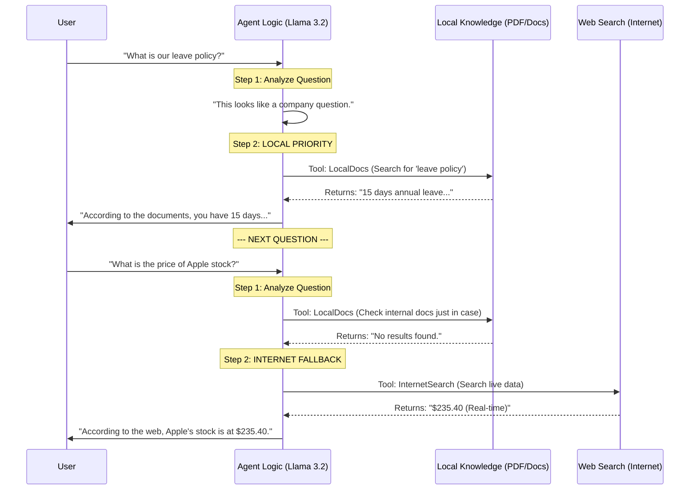

# 🔄 AI Agent Workflow: "Local-First" Logic

This document explains the step-by-step reasoning process the AI Agent follows to answer your questions.

---

## 🛑 Does it look at the internet first?
**No.** The agent is strictly programmed with a **"Local-First"** priority. It will only search the internet if your private documents do not contain the answer.

---

## 🛠️ Step-by-Step Reasoning Workflow

---

## 🔍 Why this order?
1.  **Security**: We want to find answers in your secure, private documents before reaching out to the public web.
2.  **Accuracy**: Your company documents are the "Source of Truth" for your business.
3.  **Cost & Efficiency**: Local search is faster and doesn't require an external network request.

---

## 💡 How it decides:
The agent uses a **"ReAct"** (Reasoning + Acting) loop. Before doing anything, it writes a "Thought" to itself. 

**Example Thought Process:**
> "The user is asking about the holiday calendar. This is a business question. I will use the **LocalDocs** tool to find the official calendar in the PDFs."

If you ask something highly technical or current (like *"What is the latest version of Python?"*), it will think:
> "I cannot find software version history in my documents. I will use **InternetSearch** to get the latest info."
