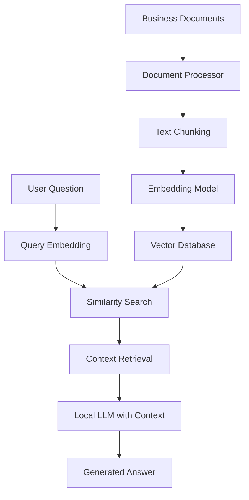

# AI Document Q&A Agent: Master Implementation & Setup Guide

This guide provides a comprehensive overview of how the AI Document Q&A Agent works (Workflow) and how to set it up from scratch (Procedure) using 100% free, local tools.

---

## 1. Implementation Workflow

The system uses a **Retrieval-Augmented Generation (RAG)** architecture. This allows the AI to provide accurate answers based on your private documents without needing to "fine-tune" the model.

### 🏗️ Architecture Overview



### 🛠️ Technology Stack (Free & Local)
- **Backend Framework**: Python + FastAPI
- **Vector Database**: ChromaDB (Runs locally on your disk)
- **Embedding Model**: `sentence-transformers/all-MiniLM-L6-v2` (Runs locally on your CPU/GPU)
- **LLM Engine**: Ollama (Hosts models like Llama 3.2, Mistral, and Phi-3 locally)
- **Logic Framework**: LangChain (Orchestrates the retrieval and generation steps)

---

## 2. Core Components

### 📄 Phase 1: Document Processing
1. **Loading**: Read files (PDF, DOCX, TXT) using specialized loaders.
2. **Chunking**: Split long documents into smaller segments (e.g., 1000 characters) to ensure the AI can focus on specific parts of the text.
3. **Embeddings**: Convert these text chunks into mathematical vectors (numbers) that represent their meaning.

### 🗄️ Phase 2: Vector Storage
1. **Indexing**: Store the vectors and their original text in ChromaDB.
2. **Retrieval**: When a question is asked, convert the question into a vector and find the most similar text chunks in the database using "Similarity Search."

### 🤖 Phase 3: Answer Generation
1. **Context Injection**: Take the retrieved text chunks and feed them into the Local LLM (Ollama).
2. **Prompting**: Use a template that instructs the AI: *"Use ONLY the provided context to answer the question accurately."*
3. **Generation**: The LLM generates a natural language response.

---

## 3. Setup Procedure (Step-by-Step)

### Step 1: Install Ollama (Local LLM Server)
1. Download from [ollama.ai](https://ollama.ai).
2. Run the installer.
3. Pull the default model:
   ```powershell
   ollama pull llama3.2
   ```

### Step 2: Set Up the Project Environment
1. **Directory Structure**:
   ```
   ai-document-qa/
   ├── backend/
   │   ├── src/services/  # Business logic
   │   ├── src/api/       # API endpoints
   │   ├── index_documents.py
   │   └── query.py
   ├── documents/raw/      # Your PDFs/Docs go here
   └── chroma_db/          # The vector storage
   ```
2. **Install Dependencies**:
   ```powershell
   pip install fastapi uvicorn langchain langchain-community chromadb sentence-transformers ollama PyPDF2 python-docx pydantic python-dotenv
   ```

### Step 3: Index Your Documents
1. Place your business documents in `documents/raw/`.
2. Open a terminal in the `backend` directory and activate the environment:
   ```powershell
   cd backend
   .\venv\Scripts\activate
   ```
3. Run the indexing script:
   ```powershell
   python index_documents.py
   ```
   *Note: On first run, this will download the embedding model automatically.*

### Step 4: Run the Frontend
1. Open a new terminal in the `frontend` directory.
2. Install dependencies (if you haven't already):
   ```powershell
   npm install
   ```
3. Start the Vite development server:
   ```powershell
   npm run dev
   ```
4. Open your browser to the URL shown in the terminal (usually `http://localhost:5173`).

---

### Step 5: Ask Questions (Backend)
- **Option A: Web Interface (Recommended)**
  - Ensure the backend API is running:
    ```powershell
    cd backend
    .\venv\Scripts\activate
    uvicorn src.api.main:app --reload
    ```
  - Open the React frontend in your browser.
  - Type your question and hit Send.

- **Option B: Interactive Terminal Mode**
  ```powershell
  cd backend
  .\venv\Scripts\activate
  python query.py
  ```

- **Option C: API Documentation (Swagger)**
  - Once the backend is running, visit: `http://localhost:8000/docs`

---

## 💡 Key Benefits of this Local Workflow
- **$0 Cost**: No API fees for OpenAI or Pinecone.
- **Privacy**: Your business documents never leave your computer.
- **Offline**: Works without an internet connection (after initial setup).
- **Speed**: Local indexing and retrieval are extremely fast.
- **Modern UI**: Clean, glassmorphic interface for better user experience.

---

## 🚀 Advanced Next Steps
1. **Hybrid Search**: Combine vector search with keyword search for better accuracy.
2. **Conversational Memory**: Allow the agent to remember previous questions in the chat.
3. **Multi-Document Upload**: Add a feature to upload new files directly from the UI.
