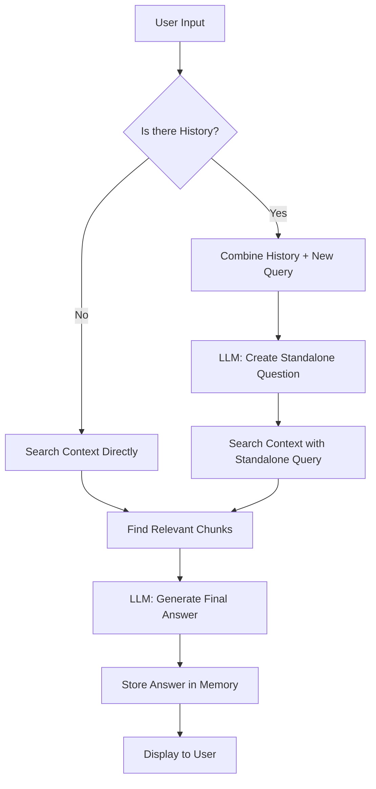
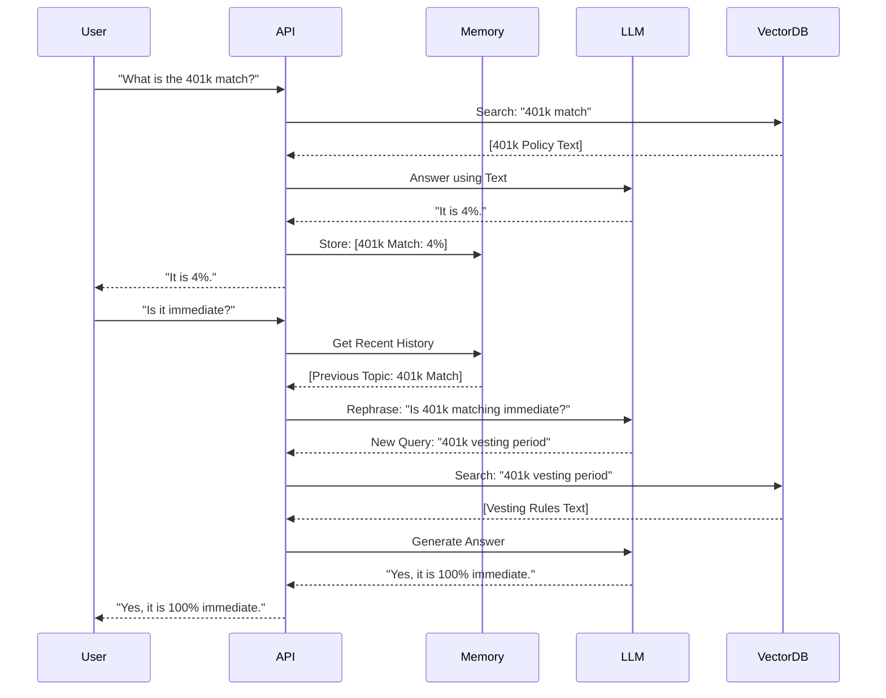

# 🧠 Feature Design: Conversational Memory

This document explains the technical architecture and user-facing features of the **Conversational Memory** upgrade.

---

## 1. Feature Overview
The "Conversational Memory" feature transforms the AI from a simple search tool into a **context-aware assistant**. It allows the agent to maintain the "thread" of a conversation across multiple messages.

### **New capabilities:**
- ✅ **Pronoun Resolution**: Understands "it", "they", "she", or "he" based on previous context.
- ✅ **Follow-up Depth**: Dive deeper into a topic without repeating the subject.
- ✅ **Contextual Constraints**: Remember earlier instructions (e.g., "Keep your answers short").
- ✅ **Natural Dialogue**: Feels like talking to a human who is paying attention.

---

## 2. Architectural Diagrams

### **A. Logic Flow: The "Rephrasing" Mechanism**
The biggest change is how the AI handles your input. It no longer searches directly with your words; it first "thinks" about the context.

### **B. Sequence Diagram: Multi-Turn Interaction**
This shows the interaction for a typical follow-up question.

---

## 3. Data Structure
The memory is stored as a "Buffer" of messages in the backend RAM.

| Message Type | Content |
| :--- | :--- |
| **System** | You are a helpful assistant... |
| **User** | What is TechVision's retirement plan? |
| **AI** | They offer a 401k with a 4% match. |
| **User** | Is it immediate? |
| **AI** | Yes, the matching is 100% immediate from day one. |

---

## 4. Why this works better?
In a standard system (like the one we have now), asking "Is it immediate?" would fail because the word "it" has no meaning. In the new system, the AI **automatically updates** your question to be searchable.

| Original Question | AI Rephrased Question (Sent to Database) |
| :--- | :--- |
| "What are the rules for annual leave?" | "What are the company's annual leave rules?" |
| "What about sick leave?" | "What are the rules for company sick leave?" |
| "Can I combine them?" | "Can an employee combine annual leave and sick leave?" |

---

## 5. Implementation Roadmap
1. **Service Layer**: Update `qa_service.py` to use `langchain_classic.memory.ConversationBufferMemory`.
2. **Chain Layer**: Switch to `ConversationalRetrievalChain`.
3. **API Layer**: Add a `/reset` endpoint to clear history.
4. **UI Layer**: Add a "Clear History" button to the frontend.
