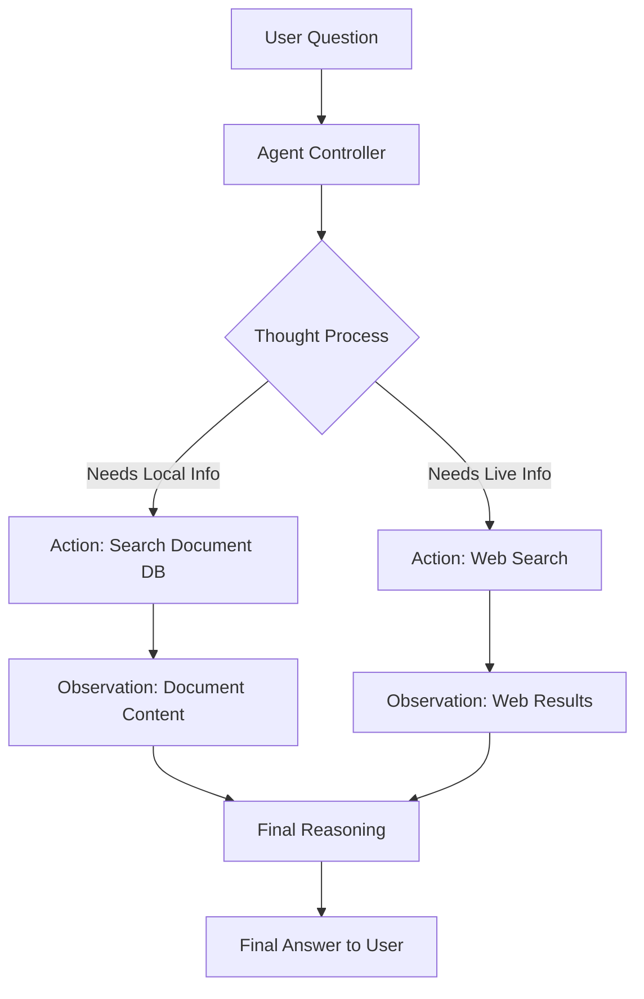

# 🌐 Master Plan: Internet Access (Level 2 Expansion)

This document contains the complete technical design, implementation steps, and architectural diagrams for adding **Internet Access** to your AI Agent.

---

## 1. Feature Goal
Transform the agent from a "Document Reader" into a "Multi-Source Assistant." The agent will decide autonomously whether to search your **private documents** or the **live internet** based on your question.

---

## 2. Dynamic Workflow (The Agentic Loop)

Unlike a simple chain, our new **Agent** will follow the "Reasoning + Acting" (ReAct) pattern.

---

## 3. Toolset Configuration
We will equip the agent with two primary "tools":

| Tool Name | Technology | Description |
| :--- | :--- | :--- |
| **Local Knowledge** | ChromaDB + LangChain | Used for anything related to company policy, internal docs, or private project data. |
| **Web Search** | DuckDuckGo Search | Used for current events, technical documentation, or general world knowledge. |

---

## 4. Implementation Details

### **A. Backend Setup**
1. **Dependencies**: Add `duckduckgo-search` to your environment.
2. **Modular Tooling**: Refactor `qa_service.py` to expose the Vector Store as a LangChain Tool.
3. **Agent Executor**: Replace the `ConversationalRetrievalChain` with a `BaseChatAgent` that supports memory + tools.

### **B. Prompt Engineering (The "System" Message)**
We will use a specialized prompt to ensure the AI uses its tools correctly:
> *"You are an assistant with access to a Local Knowledge Base and Web Search. ALWAYS check the Local Knowledge Base first if the question seems related to internal documents. Use Web Search only for things you cannot find internally."*

---

## 5. Security & Privacy Facts
- 🔒 **Data Sanitization**: Your private document content is NEVER sent to the web search tool. Only the *extracted keywords* from your question are sent to DuckDuckGo.
- 🏠 **Local First**: The system will be configured to prioritize your local database.

---

## 6. Verification Checklist
- [ ] Install `duckduckgo-search` package.
- [ ] Test the search tool independently.
- [ ] Verify the agent correctly switches between "Local" and "Web" modes.
- [ ] Ensure conversational memory still works alongside tools.

---

## ⚙️ How to Start Implementation
1. Activate your backend environment.
2. Run `pip install duckduckgo-search`.
3. Update `qa_service.py` with the Agent logic.
