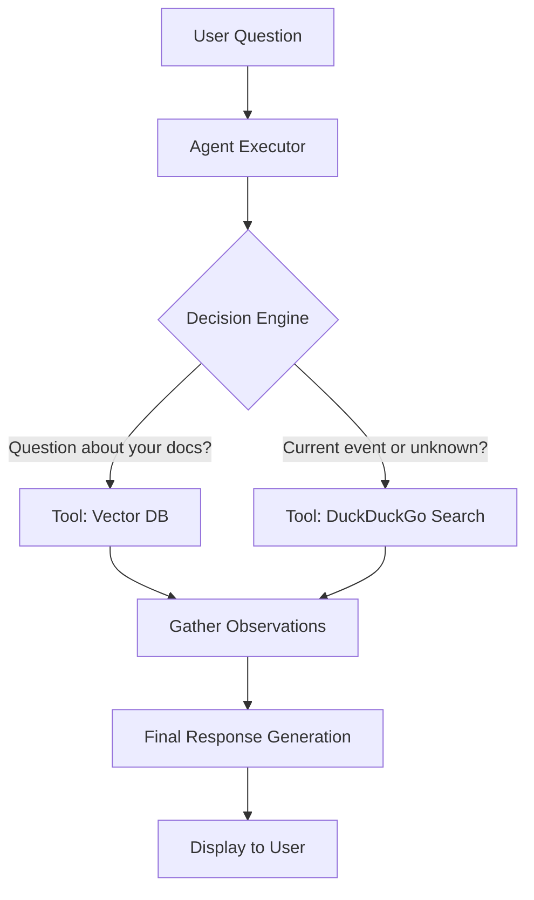

# 🌐 Project Expansion: Digital Skills (Level 2) - Internet Access

This plan outlines the steps to give your AI Agent "Digital Skills" by allowing it to search the internet when it cannot find an answer in your local documents.

---

## 1. The Strategy: Chain vs. Agent
Currently, our system uses a **Chain** (a fixed sequence of steps). To add internet access, we must upgrade to an **Agent**.

| Feature | Chain (Current) | Agent (New) |
| :--- | :--- | :--- |
| **Logic** | Follows a strict path: Load -> Search -> Answer | Decides *which tool* to use based on the question. |
| **Tools** | Only Vector Database (Local Docs) | Vector Database + Internet Search + Calculator, etc. |
| **Reasoning**| Limited | Uses a "ReAct" (Reason + Act) loop to solve problems. |

---

## 2. Architecture Diagram



---

## 3. Technology Stack (100% Free)
- **Search Tool**: `DuckDuckGoSearchRun` (Free, no API key needed).
- **Agent Framework**: LangChain Agents (OpenSource).
- **Local Model**: Ollama (Llama 3.2 or Mistral - both support Tool Calling).

---

## 4. Implementation Steps

### **Step 1: Install New Dependencies**
```powershell
pip install duckduckgo-search
```

### **Step 2: Define the Tools**
We will wrap our `qa_service` and the `DuckDuckGo` search into a list of "Tools" that the AI can choose from.
- **Tool 1**: "Local Knowledge Base" (Searches your PDFs/Word files).
- **Tool 2**: "Web Search" (Searches the live internet).

### **Step 3: Update QA Service**
Transform the `answer_question` method to use an `AgentExecutor`. The agent will perform a "Reasoning" step first:
- *AI Thought*: "The user is asking about the current stock price of Apple. This isn't in my local documents. I should use the Web Search tool."

### **Step 4: Frontend Observation UI**
Update the React UI to show when the AI is "Searching the Web" or "Reading Documents" so the user knows what's happening.

---

## 5. Example Interaction

**User**: "What is the company leave policy?"
**Agent**: *Searches Local Docs* -> "15 days."

**User**: "What is the weather in New York today?" (Not in docs)
**Agent**: *Searches Web* -> "It is currently 72°F and sunny in New York."

---

## 6. Security & Privacy
- **Privacy Mode**: The agent will only send the *search query* to the internet, not your private document content.
- **Local Priority**: We will instruct the agent to always check your local documents first before going to the web.

---

**Ready to proceed?** I can start by integrating the DuckDuckGo search tool into your backend!
